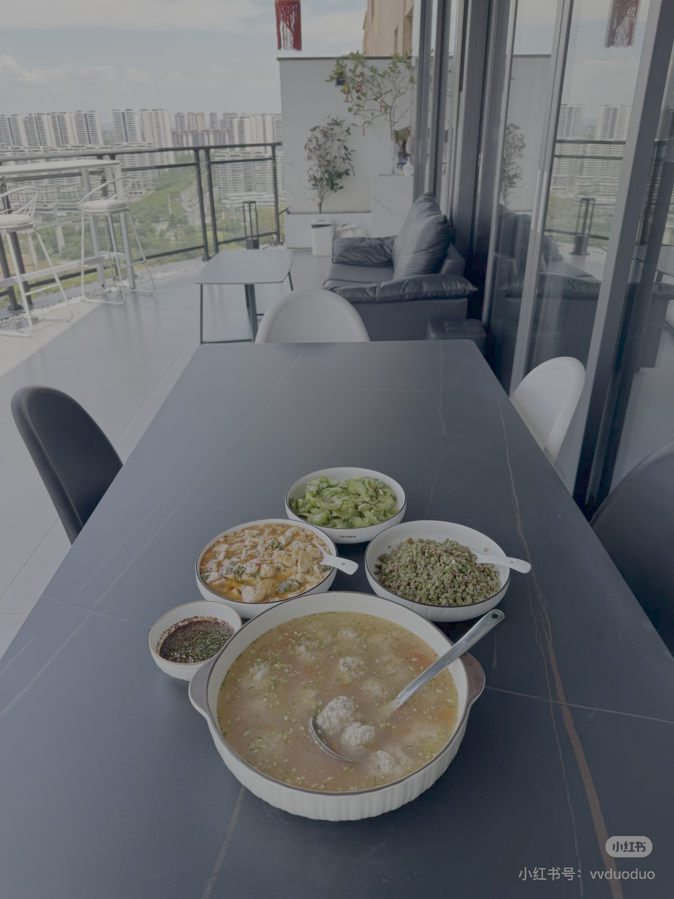
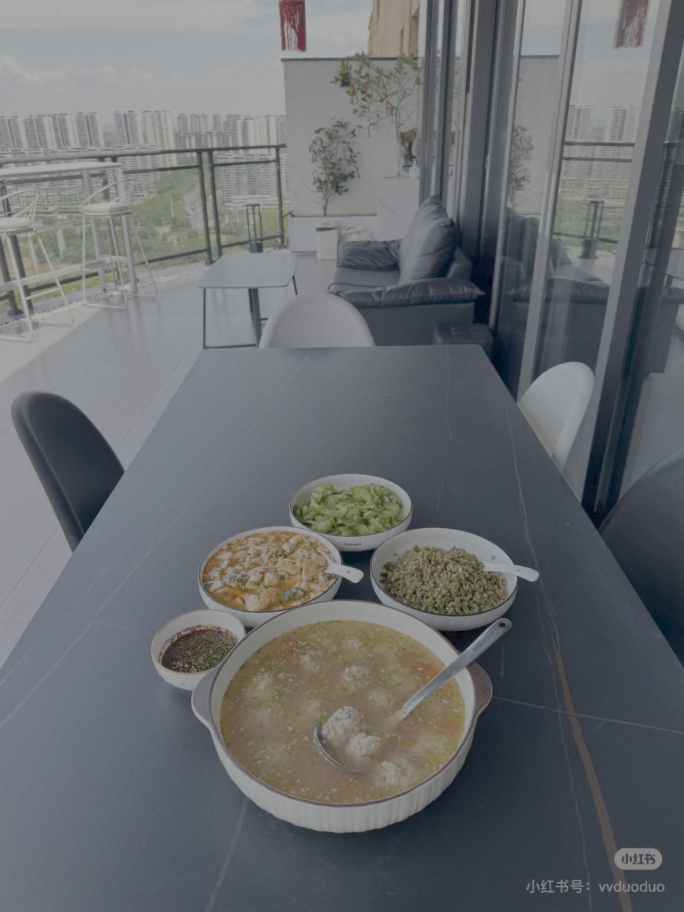
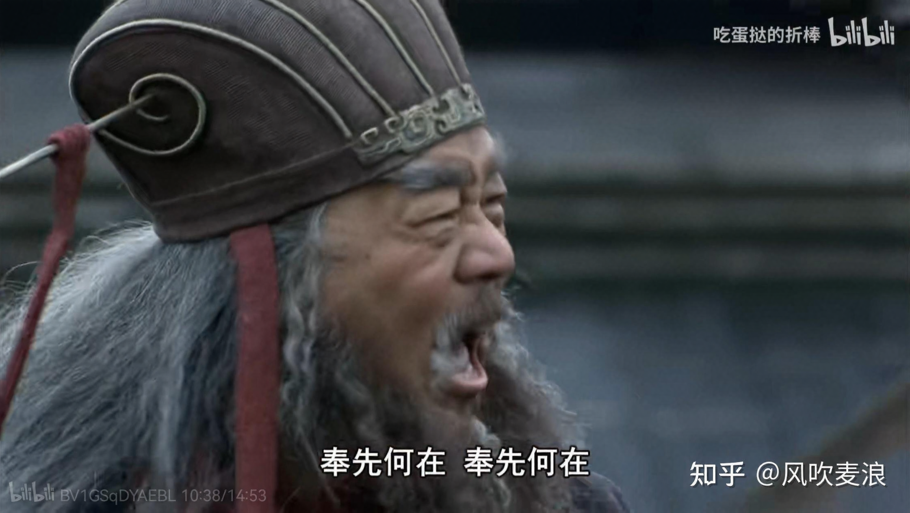
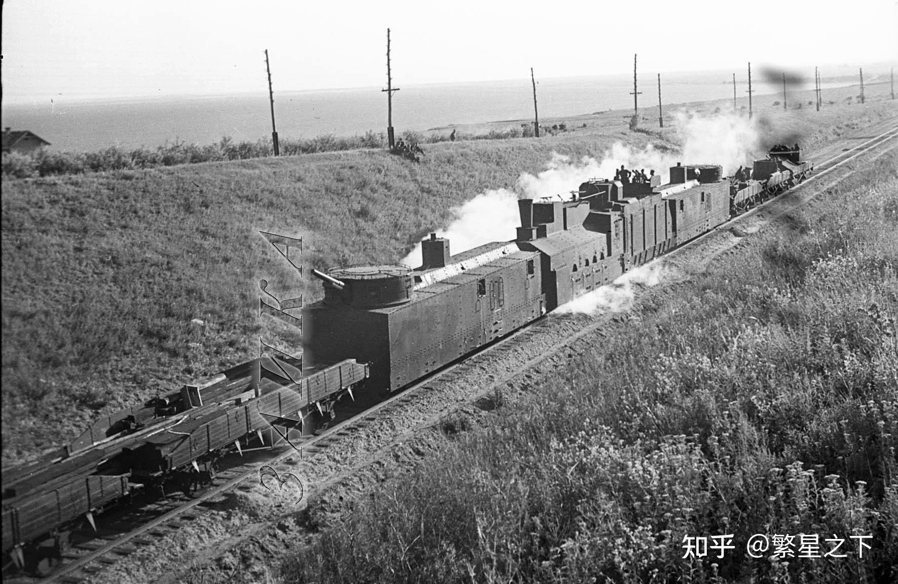
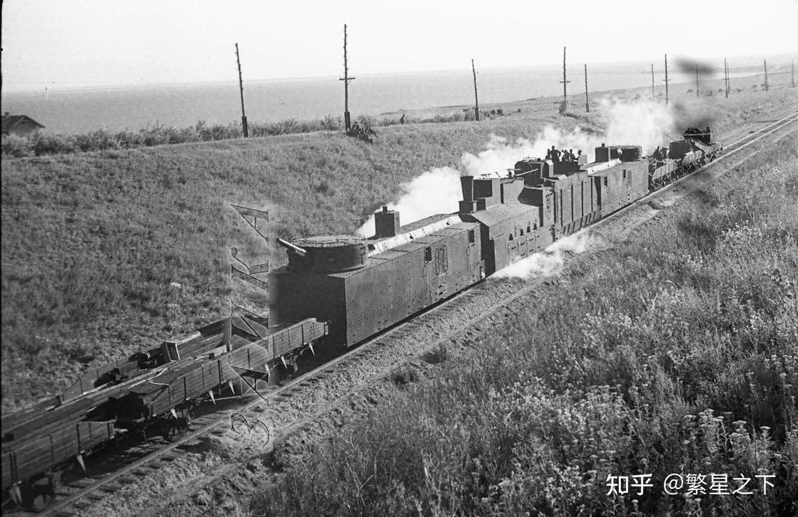

# 通用的鲁棒图像隐写术/不可见水印管线

[简体中文](README.md) | [繁體中文](README_ZH-Traditional.md) | [English](README_EN.md)

本项目是一套基于 VAE 在图像潜空间 latent 上进行秘密信息隐藏的图像隐写管线，覆盖载体图像预处理、秘密消息成帧与纠错、VAE 编解码、稳定嵌入位置选择、秘密提取、JPEG 鲁棒性评估、图像质量评估和批量测试。所有运行参数集中在 [`Config/config.yaml`](Config/config.yaml) 中管理。


## 核心特性

- 使用 SD3 系列 LDM 模型原生 VAE 将载体图像编码为 `latent`，并将嵌入秘密信息后的 `latent` 解码为隐写图像。
- 支持直接输入 `[16,H,W]` 或 `[1,16,H,W]` 的 `.pt` 格式 `latent`，便于绕过图像编码阶段做研究和调试。
- 支持 UTF-8、GBK、ASCII 和 UTF-16 文本编码，也支持原始字节或字节对齐 bit 序列。
- 使用紧凑的固定长度头部帧记录编码方式、ECC 方案、Payload 长度和校验信息，不依赖容易受损的结束标记。
- 可选 Hamming(7,4) 纠错，并使用 CRC8/CRC32 分别校验头部和 Payload。
- 支持严格稳定图、归一化插值和解析式频带三种嵌入位置策略。
- 输入图像尺寸不规整时，可选择直接拉伸或保持比例缩放后中心裁剪。
- 容量随实际载体像素数动态计算，默认预算为 `0.005 bit/pixel`。
- 内置 PNG、JPEG 90/70/50 提取测试，以及 PSNR、SSIM、LPIPS 图像质量评估。

## 工作流程


**嵌入流程：**
```text
载体图像
   │
   ├─ 尺寸检查与规范化 ──> RGB 图像
   │
   └─ 原生 VAE（FP32）编码 ──> cover latent
                                      │
秘密文本/字节/bit ──> 编码 ──> 头部帧 ──> ECC ──> 最终 bit 流
                                      │
稳定性得分图/解析频带 ──> DCT 位置选择 ──> alpha 计算 ──> latent 嵌入
                                                              │
                                                        原生 VAE 解码
                                                               │
                                                            隐写图像
```

**提取流程：**
```text
PNG/JPEG 隐写图像 ──> 微调编码器 ──> latent ──> 相同位置与参数提取
                     ──> 头部多数表决 ──> ECC 纠错 ──> CRC 校验 ──> 文本/字节
```

嵌入端和提取端必须使用一致的模型权重、稳定性策略、通道分组和隐写参数，否则双方选择的位置或判决边界可能不同。

## 项目结构

```text
PipeLine/
├── Config/
│   └── config.yaml                 # 唯一配置文件，中英文注释
├── Weights/
│   ├── vae_config.json              # 原生 VAE 结构配置
│   ├── diffusion_pytorch_model.safetensors # 原生 VAE 权重
│   ├── encoder_final.pth            # 微调后的独立提取编码器
│   ├── stability_*.npz              # 压缩稳定性得分图
│   └── ONNX/                        # BF16 权重存储、FP32 计算的 ONNX 中间模型
├── Stego/                           # 默认隐写 PNG 输出目录
├── Test/
│   ├── Cover/                       # 批量测试载体图像
│   ├── Stego/                       # 批量测试隐写图像
│   └── Reports/report.md            # 最新批量测试报告
├── configuration/                   # YAML 加载、校验与配置对象
├── preprocessing/                   # 图像规范化、Payload、帧头、ECC
├── models/                          # 原生 VAE 与改造编码器的延迟加载
├── stability/                       # 稳定图生成、匹配、插值与加载
├── steganography/                   # DCT、位置选择、alpha 和 bit 编解码
├── embedding/                       # 完整嵌入服务
├── extraction/                      # 完整提取服务
├── evaluation/                      # JPEG 攻击与质量/准确率指标
├── testing/                         # 批量测试和 Markdown 报告生成
├── tests/                           # 单元测试和伪模型集成测试
├── pipeline.py                      # Python 公共门面 StegoPipeline
├── cli.py                           # 命令行入口
├── position_strategy_debug.py       # 两种无严格稳定图策略的调试入口
├── tools/export_onnx.py              # 可重复执行的 ONNX 导出工具
├── profiles.py                      # 图像规格与动态容量 profile
├── schemas.py                       # 输入输出数据结构
└── requirements.txt                 # Python 依赖
```

## 模型权重与作用

正式 Pipeline 的模型文件位于 `PipeLine/Weights/`，配置默认直接从该目录加载：

```text
PipeLine/Weights/vae_config.json
PipeLine/Weights/diffusion_pytorch_model.safetensors
PipeLine/Weights/encoder_final.pth
```

路径可在 `Config/config.yaml` 的 `model.original_vae` 和 `model.modified_encoder` 中修改；相对路径以 `PipeLine/` 为基准解析。

两个模型在链路中的职责不同：

| 模型 | 文件 | 作用 |
| --- | --- | --- |
| 原生 VAE | `vae_config.json` + `diffusion_pytorch_model.safetensors` | 嵌入前将载体 RGB 图像编码为 latent；DCT 嵌入完成后再将 stego latent 解码为 PNG 隐写图像 |
| 微调后的独立编码器 | `encoder_final.pth` | 提取时将 PNG/JPEG 隐写图像重新编码为 latent，使后续 DCT 判决、头部恢复和 ECC 解码能够提取秘密 |

### 权重存储精度与 FP32 upcast

经实际逐张量检查，`diffusion_pytorch_model.safetensors` 的 244 个张量均以 **BF16** 保存。BF16 只是减小 checkpoint 体积的存储形式；加载时由 Pipeline 构建 FP32 模型并把权重上转换到 FP32，后续 VAE 推理也保持 FP32，以取得当前项目的最佳效果。

当前仓库中的 `encoder_final.pth` 经检查包含 106 个 **FP32** 张量，本身已是 FP32，并非 BF16。Pipeline 仍显式按 `model.dtype: float32` 加载它。若未来将微调编码器另存为 BF16，也必须在加载后上转换为 FP32，再引用本项目的 FP32 评测结论。这里以文件实际 dtype 为准，不将当前编码器错误标注为 BF16。

两个复制后的权重已与原始 `Weights/` 文件进行 SHA-256 一致性校验，内容保持不变。

## ONNX 中间模型与边缘部署

为了后续部署，原生 VAE 按隐写流程拆成 encoder 和 decoder 两个子图，微调编码器单独导出。产物位于 `PipeLine/Weights/ONNX/`：

| ONNX 文件 | 输入 → 输出 | 大小（约） |
| --- | --- | ---: |
| `original_vae_encoder_bf16.onnx` | `[N,3,H,W]` RGB 归一化张量 → `[N,16,H/8,W/8]` shifted/scaled latent | 68.7 MB |
| `original_vae_decoder_bf16.onnx` | `[N,16,H,W]` shifted/scaled latent → `[N,3,H×8,W×8]` 图像张量 | 99.2 MB |
| `modified_encoder_bf16.onnx` | `[N,3,H,W]` 隐写图像张量 → `[N,16,H/8,W/8]` shifted/scaled latent | 68.7 MB |

三个 ONNX 图的大体积 initializer 均以 **BF16 存储**，并在图内通过 `Cast(BF16→FP32)` 上转换；公开输入、输出与实际算子计算仍保持 **FP32**。这使文件体积约减少 50%，但运行时需展开 FP32 权重，因此不保证显存/内存也按同比例降低。模型包含 Pipeline 使用的 `shift_factor=0.0609` 与 `scaling_factor=1.5305`，并设置动态 batch、宽度和高度轴。三个图均已通过 ONNX checker 和 ONNX Runtime 实际推理验证。

原生 VAE 的源权重本身就是 BF16，因此该 ONNX 版与旧 FP32 导出在测试输入上数值一致。微调编码器的源 checkpoint 是 FP32，其 ONNX 副本转为 BF16 存储后会产生轻微舍入；64×64 测试的 latent 平均绝对差为 0.00132，最大绝对差为 0.00468。这些 ONNX 文件尚未单独获得完整隐写评测背书。

可重复执行导出：

```powershell
conda run -n base python -m PipeLine.tools.export_onnx
```

默认使用 `--weight-storage bfloat16`。可通过 `--config`、`--output-dir`、`--sample-size`、`--opset` 和 `--weight-storage float32` 覆盖默认值。

> **ONNX 仅作为中间交换格式，不是最终部署格式，也不代表已经获得与 PyTorch FP32 相同的完整隐写评测成绩。** 实际部署前仍需按目标设备转换和优化，例如 NVIDIA TensorRT engine、Intel OpenVINO IR、Apple Core ML，或移动端/专用 NPU 所要求的格式，并验证算子支持、动态尺寸、内存布局、归一化、latent shift/scale 和数值精度。任何 FP16、BF16、FP8 或 INT8 转换都必须重新校准稳定性得分图并重新测试提取准确率、CRC 和图像质量。

## 环境安装

推荐使用支持 CUDA 的 PyTorch 环境。项目已按本机 Conda `base` 环境进行测试：

```powershell
conda activate base
python -m pip install -r PipeLine/requirements.txt
```

主要依赖包括 PyTorch、Diffusers、Safetensors、SciPy、Pillow、PyYAML、scikit-image 和 LPIPS。若使用 GPU，请先安装与本机 CUDA 驱动匹配的 PyTorch 版本。

运行前建议确认：

1. 原生 VAE 配置和权重存在；
2. 改造编码器权重存在；
3. `model.dtype` 保持为 `float32`；
4. 所选稳定性策略具备对应稳定图，或已配置可用的回退策略；
5. GPU/系统内存足以处理目标分辨率。

## 配置文件

全部配置均位于 [`Config/config.yaml`](Config/config.yaml)，并按以下大类组织：

| 配置段 | 用途 |
| --- | --- |
| `model` | 设备、FP32 精度、VAE/编码器权重、latent 约定 |
| `preprocessing` | 文本编码、ECC、头部重复、图像尺寸调整、动态容量 |
| `stability` | 稳定图生成、保存和三种匹配策略 |
| `steganography` | 通道分组、位置数、阈值、alpha 与自适应参数 |
| `extraction` | 输入归一化、投票平局规则、文本解码策略 |
| `evaluation` | PSNR、SSIM、LPIPS 与 JPEG 攻击等级 |
| `testing` | 测试目录、随机种子、容量利用率和报告输出 |

指定自定义配置文件时，将全局参数放在子命令之前：

```powershell
python -m PipeLine.cli --config path/to/config.yaml embed --image cover.png --text "秘密信息"
```

## 图像预处理与尺寸规范化

VAE 需要图像宽高与下采样结构兼容。`preprocessing.image_adjustment.multiple` 定义输出宽高必须满足的倍数，默认值为 `8`，并且必须兼容 `model.latent.downsample_factor`。

当输入宽高不是该倍数时，Pipeline 会发出 warning，明确显示原始尺寸和调整后尺寸。可选方法如下：

- `stretch`：分别将宽和高直接缩放到最近的合法倍数。速度直接，但可能轻微改变原始宽高比。
- `scale_crop`：保持宽高比进行缩放，再从中心裁剪到最近的合法尺寸。默认使用该方法，避免几何拉伸，但可能裁去少量边缘内容。

输出采用配置中的 `nearest`、`bilinear`、`bicubic` 或 `lanczos` 重采样算法。默认配置为：

```yaml
preprocessing:
  image_adjustment:
    multiple: 8
    method: scale_crop
    resample: lanczos
```

`1024x1024`、`1536x1024`、`1024x1536` 是预设隐写参数 profile。其他合法尺寸会根据实际宽高动态创建 profile，并复用几何上最接近的预设隐写参数。

## Payload、头部帧与 ECC

输入秘密可以是以下三类之一：

- `text`：按配置的 UTF-8、GBK、ASCII 或 UTF-16 编码；
- `data`：直接输入任意字节；
- `bits`：输入只包含 0/1 且长度能按字节对齐的序列。

字节以 MSB-first 顺序转换为 bit。默认最终码流为：

```text
固定头部 × 3 + Hamming74(payload_bits)
```

每份逻辑头部为 67 bit：

| 字段 | 长度 | 说明 |
| --- | ---: | --- |
| 文本编码 | 2 bit | `00=UTF-8`、`01=GBK`、`10=ASCII`、`11=UTF-16` |
| ECC 方案 | 1 bit | `0=none`、`1=hamming74` |
| 原始 Payload 长度 | 24 bit | 记录纠错编码前的有效 bit 数 |
| Payload CRC32 | 32 bit | 验证最终恢复的数据 |
| 头部 CRC8 | 8 bit | 验证逻辑头部 |

头部默认重复 3 次并逐 bit 多数表决，因此头部总开销为 201 bit。提取端从头部获得实际 Payload 长度和 ECC 参数，不使用结束位标记，也不依赖扫描某个终止序列。

Hamming(7,4) 可纠正每个 7-bit 码字内的单 bit 错误，但不能保证识别或恢复所有多 bit 错误；CRC32 是 Payload 完整性是否通过的最终依据。ECC 只提升容错能力，隐写本身也不提供加密，敏感秘密应在嵌入前单独加密。

## 容量计算

图像的像素预算上限按实际规范化后尺寸动态计算：

```text
pixel_budget = floor(width × height × capacity_bits_per_pixel)
```

默认 `capacity_bits_per_pixel = 0.005`。例如，1024×1024 图像的像素预算为 5242 bit。该数值是**最终成帧码流**的预算，包含重复头部和 ECC 冗余，并不等于用户可输入的纯 Payload 长度。

### 高容量模式

在以 **PNG 提取准确率保持 100%、LPIPS 维持在约 0.05** 为目标的场景中，可通过同时降低基础嵌入强度 `base_alpha`、针对实际稳定图重新选择 `stability_threshold`，并提高每个 latent 8×8 块的 `positions_per_block`，将更多 bit 分散到更多稳定位置。在完成针对性标定和逐图验证后，可将 `capacity_bits_per_pixel` 提高到 `0.02`：

```text
floor(1024 × 1024 × 0.02) = 20971 bit
```

即 1024×1024 图像的最终成帧嵌入容量约为 **2 万 bit**。这里的 20971 bit 包含重复头部和 ECC 冗余；启用默认 Hamming(7,4) 后，用户可用的原始 Payload bit 数会更少。

该高容量结论属于需要重新标定的调参目标，不是当前默认 `positions_per_block=3`、`stability_threshold=0.8`、`base_alpha=0.22` 配置的自动保证。实际 DCT 可选位置必须不少于像素预算，同时应使用与目标图片风格、分辨率和比例匹配的稳定性得分图。降低 `base_alpha` 有助于控制模糊和 LPIPS，提高 `positions_per_block` 用于补充容量，而 `stability_threshold` 需要在位置数量与可靠性之间重新选择；最终必须在独立验证集上确认 PNG 提取达到 100%，并逐图检查 LPIPS 是否维持在约 0.05。

实际可嵌入量还受到 DCT 稳定位置数量限制：

```text
effective_capacity = min(pixel_budget, selected_DCT_capacity)
```

因此，即使图像像素预算足够，当稳定性阈值过高、每块位置数过少或所选稳定图可用位置不足时，也可能报告容量不足。启用 Hamming(7,4) 后，每 4 bit Payload 会扩展为 7 bit，且还需扣除 201 bit 头部开销，所以有效文本容量明显小于 `pixel_budget`。

## 稳定性得分图与位置策略

稳定性得分描述 latent DCT 位置经过 VAE 解码和重新编码后保持数值/判决稳定的程度。嵌入和提取复用相同的得分与排序逻辑。

> **当前 1024×1024 稳定图的数据域限制（重要）**
>
> 当前随项目提供的 `PipeLine/Weights/stability_1024x1024.npz` 基于 **Alaska2 数据集**计算得到。该数据集样本的原始分辨率和图像质量相对有限，其内容风格、纹理分布、压缩特征与真实业务图片可能存在明显差异。因此，这张稳定图只能作为已有实验先验或缺少目标数据时的回退基线，不能视为适用于所有图片的通用稳定性指标。
>
> 当它被直接用于其他数据域，或经 `normalized_interpolation` 扩展到不同分辨率和宽高比时，选出的 DCT 位置可能并非目标图片中真正稳定的位置。这既可能降低 PNG/JPEG 下的秘密提取精度、增加头部或 Payload CRC 错误，也可能把较强修改施加到视觉敏感区域，从而降低 PSNR、SSIM、LPIPS 等图像质量表现。

为了取得最佳效果，正式部署前应使用实际业务的一批代表性图片重新运行稳定性得分图计算。样本应覆盖预计输入中的不同内容风格、纹理复杂度、清晰度、来源/压缩质量、分辨率和宽高比。建议按“风格或数据来源 + 分辨率/比例档位”划分数据组，并为各组分别生成、验证和保存匹配的稳定性得分图，而不是只依赖 Alaska2 的单一 1024×1024 先验。

推荐流程如下：

1. 从真实业务数据中抽取具有代表性的样本，并保留独立验证集。
2. 按摄影/插画/低纹理/高纹理等风格，以及 1:1、3:2、2:3、16:9 等常见比例和目标分辨率分组。
3. 对每组图片使用正式部署所采用的模型权重、FP32 精度、预处理和 latent 规范生成原始/重建 latent 对。
4. 分组计算稳定性得分图，并在对应图片组上重新标定 `stability_threshold`、`positions_per_block` 和 `base_alpha`。
5. 使用未参与计算的验证图片检查 PNG/JPEG 提取率、CRC 成功情况和图像质量，推荐继续以单图 `LPIPS < 0.05` 为质量目标。
6. 部署时根据输入图片所属的数据域、分辨率和比例选择最匹配的稳定图；没有严格匹配时才使用插值或解析频带策略回退。

如果同一分辨率包含差异很大的图片风格，建议维护不同业务场景的 `Weights` 集合或独立配置，避免同名 profile 的稳定图相互覆盖。稳定图生成数据、模型权重、精度和关键预处理发生变化后，都应重新验证，不能沿用原有成绩。

通过 `stability.map_matching.strategy` 选择策略：

### `strict`

只接受与目标图像 profile 严格对应的 `stability_<宽>x<高>.npz`。该模式可控性最好，适合正式评测和对固定分辨率做过充分预计算的环境；缺少对应文件时直接报错。

### `normalized_interpolation`

优先加载严格对应的稳定图。若不存在，则综合宽高比差异和面积差异，从 `PipeLine/Weights/` 中选择最接近的稳定图，并插值到目标 latent 尺寸。该模式适合分辨率和比例不固定的输入，也是当前默认策略。

插值只是工程回退方案，不能等价于针对目标分辨率预计算的稳定图。对于高可靠性需求，应逐步补充常用分辨率的原生稳定图并复测。

### `analytic_band`

不依赖任何先验稳定图，按 DCT 归一化径向频率、频带中心、带宽和通道先验解析生成得分。它适合未知尺寸、冷启动或对照实验，但稳定性来自频带假设而非真实重建统计，必须独立评估提取率与图像质量。

## 隐写控制参数

每个图像 profile 都有独立的 `positions_per_block`、`stability_threshold` 和 `base_alpha`。这里的“8×8 块”是 **latent 空间的 8×8 DCT 分块**，不是直接在原图像像素上分块。

| 参数 | 直接作用 | 增大后的典型影响 |
| --- | --- | --- |
| `positions_per_block` | 每个 latent 8×8 块、每个通道最多选择多少个 DCT 位置 | 候选容量上升、修改密度增大、图像质量更易下降 |
| `stability_threshold` | 只允许得分不低于阈值的位置参与嵌入 | 可用位置减少、容量下降；通常位置更可信，但过高可能直接容量不足 |
| `base_alpha` | 每个 latent 通道的基础嵌入强度/判决裕量 | 鲁棒性通常上升，但失真和细微模糊更明显 |

三者的关系如下：

- `positions_per_block` 与 `stability_threshold` **共同决定稳定位置的实际容量上限**。前者给每块设置数量上限，后者再过滤不够稳定的位置。
- `base_alpha` 不直接增加名义 bit 容量，主要决定嵌入后的判决裕量与鲁棒性。
- 增加 `positions_per_block` 或降低 `stability_threshold` 通常可以容纳更多 bit，但会使用更多或较不稳定的位置。
- 提高 `base_alpha` 通常有利于抵抗 VAE 重编码和 JPEG 压缩，但会增大 latent 修改幅度。
- 更高嵌入容量和更强 `base_alpha` 都会更明显地损害图像质量；本系统常见视觉副作用是隐写图像出现细微模糊或局部纹理软化。

`base_alpha` 是 16 个 latent 通道各自的数组。启用 `content_adaptive` 和 `frequency_adaptive` 后，实际位置使用的 alpha 还会根据内容能量和频率权重调整，并受 `minimum_alpha`、`maximum_alpha` 限制。因此配置中的 `base_alpha` 是基础值，不一定是每个位置最终使用的绝对值。

默认 profile 示例：

```yaml
steganography:
  profiles:
    1024x1024:
      positions_per_block: 3
      stability_threshold: 0.8
      base_alpha: [0.22, 0.22, 0.22, 0.22, 0.22, 0.22, 0.22, 0.22,
                   0.22, 0.22, 0.22, 0.22, 0.22, 0.22, 0.22, 0.22]
```

## 图像质量与调参建议

本项目建议将 **LPIPS 保持在 `0.05` 左右** 作为视觉不可察觉性的工程目标。LPIPS 越低通常表示感知差异越小；该阈值是推荐控制线，不是对所有图像、Payload 和攻击场景的绝对保证。实际验收应同时查看原图/隐写图对比、局部纹理、单图 LPIPS 以及业务所需的压缩鲁棒性。

推荐调参顺序：

1. 保持 FP32，固定模型、稳定图策略和一组代表性载体图像。
2. 从默认的 `positions_per_block=3`、`stability_threshold=0.8` 和 `base_alpha=0.22` 起步。
3. 先确认最终码流长度低于像素预算和实际 DCT 容量。
4. 每次只改变一个参数，并同时记录 PNG/JPEG 提取结果与 PSNR、SSIM、LPIPS。
5. 若 LPIPS 超过 0.05 或模糊明显，优先减少 Payload/位置使用量，或适当降低 `base_alpha`；也可提高 `stability_threshold`，仅使用更高分位置。
6. 若图像质量合格但 JPEG 提取不稳，可小步提高 `base_alpha`，或改善稳定图、位置筛选和 ECC；不要只用大幅增加强度解决问题。
7. 不仅观察平均 LPIPS，还应关注最差样本和高分位数，避免少数纹理敏感图像出现明显失真。

容量、鲁棒性和图像质量不可同时无限提高。建议先根据业务确定实际 Payload 长度和目标攻击等级，再寻找满足 `LPIPS < 0.05` 的最低嵌入强度。

## Python API

### 图像嵌入、提取与评估

```python
from PipeLine import StegoPipeline

pipeline = StegoPipeline.from_config()

embedded = pipeline.embed(
    image="cover.png",
    text="秘密信息",
    output_name="example",
)

extracted = pipeline.extract(image=embedded.stego_path)
print(extracted.status)
print(extracted.decoded_text)

evaluation = pipeline.evaluate("cover.png", embedded)
print(evaluation.psnr, evaluation.ssim, evaluation.lpips)
for attack in evaluation.jpeg_results:
    print(attack.quality, attack.raw_bit_accuracy, attack.post_ecc_bit_accuracy)
```

默认隐写图像保存到 `PipeLine/Stego/`，格式始终为 PNG，避免保存阶段引入额外有损压缩。

### 分阶段预处理

```python
prepared = pipeline.preprocess(image="cover.png", text="秘密信息")
embedded = pipeline.embed(prepared=prepared, output_name="example")
```

### 直接使用 latent

```python
embedded = pipeline.embed(latent_path="cover.pt", text="秘密信息")
extracted = pipeline.extract(latent_path="stego_latent.pt")
```

`.pt` 文件必须只包含一个 `[16,H,W]` 或 `[1,16,H,W]` Tensor。系统根据 `model.latent.downsample_factor` 从 latent 空间尺寸反推图像 profile。输入 latent 必须符合配置中的 `shifted_scaled` 约定；旧实验中未应用相同 shift/scale 的 latent 不能直接混用。

### 评估已有图像对

```python
evaluation = pipeline.evaluate_existing(
    cover_image="cover.png",
    stego_image="stego.png",
    text="秘密信息",
)
```

载体图和隐写图经规范化后必须属于同一 profile，参考秘密必须与嵌入时一致。

## 命令行使用

以下命令均在工作区根目录运行。

### 预处理并保存 latent

```powershell
python -m PipeLine.cli preprocess `
  --image cover.png `
  --text "秘密信息" `
  --save-latent cover.pt
```

### 嵌入

```powershell
python -m PipeLine.cli embed `
  --image cover.png `
  --text "秘密信息" `
  --output-name example
```

也可以使用 `--text-file`、`--data-hex` 或 `--bits`，它们与 `--text` 互斥：

```powershell
python -m PipeLine.cli embed --image cover.png --data-hex "48656c6c6f"
python -m PipeLine.cli embed --image cover.png --bits "0100100001101001"
```

### 提取

```powershell
python -m PipeLine.cli extract --image PipeLine/Stego/example.png
```

### 评估已有载体/隐写图像

```powershell
python -m PipeLine.cli evaluate `
  --cover cover.png `
  --stego PipeLine/Stego/example.png `
  --text "秘密信息"
```

### 批量测试

```powershell
python -m PipeLine.cli test
```

批量测试读取 `PipeLine/Test/Cover/`，生成的隐写 PNG 保存到 `PipeLine/Test/Stego/`，逐图指标和汇总结果写入 [`Test/Reports/report.md`](Test/Reports/report.md)。随机 Payload 的种子、容量利用率、最大图像数量等由 `testing` 配置段控制。

当前测试配置使用：

```yaml
testing:
  payload_utilization: 0.5  # 使用有效最大容量的 50%
  max_images: null          # 扫描 Test/Cover 中全部图像
```

这里的 50% 先作用于 `min(pixel_budget, selected_DCT_capacity)`，再扣除 201-bit 头部并反推 ECC 前可生成的整字节 Payload；报告中的 `Payload bits` 因此是原始秘密 bit 数，不是包含头部和 Hamming 冗余的最终码流长度。

## 生成稳定性得分图

准备两个文件夹，其中相同 base id 的 `.pt` 文件分别表示原始 latent 和经过目标链路重建的 latent：

```powershell
python -m PipeLine.cli stability `
  --original-dir path/to/original_latents `
  --reconstructed-dir path/to/reconstructed_latents
```

生成器根据匹配 latent 的数值差异计算稳定性得分，并按对应图像规格压缩保存，例如：

```text
PipeLine/Weights/stability_1024x1024.npz
PipeLine/Weights/stability_1536x1024.npz
PipeLine/Weights/stability_1024x1536.npz
```

可用 `--max-samples` 限制参与统计的样本数，或用 `--output` 指定输出文件。转换旧的方形 `.pt` 稳定性缓存：

```powershell
python -m PipeLine.cli convert-stability `
  --input Weights/Alaska_Dct_stability.pt `
  --profile 1024x1024
```

稳定图与模型精度、权重、编解码路径和数据分布相关。改变 VAE 权重、提取编码器、数值精度或关键预处理后，应重新生成/验证稳定图，而不是沿用旧评测结论。

## 评估指标说明

| 指标 | 含义 | 方向 |
| --- | --- | --- |
| `raw_bit_accuracy` | 从判决位置直接提取的原始 bit 准确率 | 越高越好 |
| `post_ecc_bit_accuracy` | 头部恢复与 ECC 纠错后的 Payload bit 准确率 | 越高越好 |
| `text_match` | 原始文本与恢复文本是否完全一致 | `true` 为完全一致，`false` 为不一致 |
| `PSNR` | 原图与隐写图的像素信噪比 | 通常越高越好 |
| `SSIM` | 原图与隐写图的结构相似度 | 越接近 1 越好 |
| `LPIPS` | 感知特征空间差异 | 越低越好，建议 `< 0.05` |

报告中的 `N/A` 不等于准确率为 0。它表示该项无法可靠计算，例如头部/CRC 恢复失败、没有可比较的有效 Payload，或随机字节 Payload 本身不适用文本对比。判断一次提取是否完整成功时，应联合检查 `status`、`error`、CRC、ECC 后准确率和 `text_match`，不能只看单个字段。

> **精度与评测声明**
>
> 本项目以 **Float32（FP32）** 作为 VAE 编码、解码和隐写评测的标准精度。在当前模型、改造编码器和算法链路中，VAE 使用 FP32 运行可取得最优、最稳定的隐写与提取效果。配置文件默认设置为 `model.dtype: float32`。原生 VAE checkpoint 虽以 BF16 存储，但加载后必须上转换（upcast）到 FP32 再推理；不能把“权重文件的存储 dtype”误当成“受保证的计算 dtype”。
>
> README、测试报告及项目当前给出的全部质量与鲁棒性成绩，**仅对 FP32 精度下的运行结果负责**。FP16、BF16、FP8 等低精度模式可能改变 latent 数值、DCT 系数和提取判决边界，从而降低提取准确率、CRC 成功率或图像质量；这些精度目前不属于已保证范围。如需部署低精度模型，必须针对目标硬件、模型精度和推理引擎重新生成或校准稳定性得分图，并重新完成全套评测。

## 模型评测与参考结果

仓库内现有 [`Test/Reports/report.md`](Test/Reports/report.md) 使用当前 `Test/Cover` 全部 20 张图片、50% 有效最大容量、Hamming(7,4)、归一化插值稳定图策略和 **PyTorch FP32** 模型链路。20 张全部完成，无测试流程失败。

| 汇总项 | 本轮结果 |
| --- | ---: |
| 成功 / 失败图片 | 20 / 0 |
| 平均 LPIPS | 0.0433 |
| PNG 原始 bit 平均准确率 | 0.9972 |
| PNG ECC 后平均准确率 | 0.9996 |
| JPEG 90 原始 / ECC 后平均准确率 | 0.9933 / 0.9984 |
| JPEG 70 原始 / ECC 后平均准确率 | 0.9644 / 0.9968 |
| JPEG 50 原始 / ECC 后平均准确率 | 0.9431 / 0.9936 |

JPEG ECC 后平均值会忽略头部损坏而无法得到 Payload 的 `N/A` 样本：JPEG 90、70、50 分别有 19、14、13 张具备可比较的 ECC 后结果。因此这些均值不能解释为对应档位的全样本 CRC 成功率。完整的逐图准确率和 `N/A` 分布应以报告表格为准。

这些结果只代表报告中列出的样本、随机 Payload、权重、配置和运行环境，不构成其他数据集、ONNX runtime 或低精度模式下的性能保证。虽然平均 LPIPS 0.0433 低于推荐控制线，但只有 12/20 张单图低于 0.05，仍有 8 张需要按载体内容继续降低容量或调整 alpha；正式应用不能只看平均值。

### Cover / Stego 参考示例

以下示例取自 `Test/Cover` 按文件名升序排列后的最后五张图片。点击图片可查看原尺寸。文件名只显示便于识别的简称，完整路径保留在图片链接中。

| Cover | Stego | 分辨率 | 容量 | 精度（Origin / ECC） | 视觉指标 |
| :---: | :---: | :---: | --- | --- | --- |
| <a href="Test/Cover/131106338932881396_p14.png"></a><br><sub>p14</sub> | <a href="Test/Stego/131106338932881396_p14_stego.png"></a><br><sub>p14 stego</sub> | `1536×1024` | Payload <br>`2128 bit`<br>码流 <br>`3925 bit`<br>上限<br> `10190 bit` | PNG<br> `0.9995 / 1.0000`<br>J90 <br>`0.9929 / 0.9977`<br>J70<br> `0.9740 / —`<br>J50 <br>`0.9592 / —` | PSNR<br> `31.41`<br>SSIM<br> `0.9414`<br>LPIPS <br>`0.0251` |
| <a href="Test/Cover/20260818140720_1563_31.jpg"></a><br><sub>1563_31</sub> | <a href="Test/Stego/20260818140720_1563_31_stego.png"></a><br><sub>1563_31 stego</sub> | `1440×1920` | Payload <br>`3832 bit`<br>码流 <br>`6907 bit`<br>上限 <br>`18157 bit` | PNG <br>`1.0000 / 1.0000`<br>J90<br> `0.9933 / 0.9997`<br>J70 <br>`0.8455 / —`<br>J50 <br>`0.7963 / —` | PSNR <br>`37.94`<br>SSIM<br> `0.9728`<br>LPIPS<br> `0.0207` |
| <a href="Test/Cover/v2-1a5f6ca2d7303de409237de4a6e70707_r.jpg"></a><br><sub>v2-1a5f…</sub> | <a href="Test/Stego/v2-1a5f6ca2d7303de409237de4a6e70707_r_stego.png"></a><br><sub>v2-1a5f… stego</sub> | `512×512` | Payload <br>`256 bit`<br>码流<br> `649 bit`<br>上限 <br>`1823 bit` | PNG<br> `0.9553 / 0.9922`<br>J90 <br>`0.9399 / 0.9805`<br>J70<br> `0.8814 / —`<br>J50 <br>`0.8505 / —` | PSNR<br> `27.53`<br>SSIM<br> `0.9544`<br>LPIPS<br> `0.0165` |
| <a href="Test/Cover/v2-33489711df97a738a22182a331d0cece_r.jpg"></a><br><sub>v2-3348…</sub> | <a href="Test/Stego/v2-33489711df97a738a22182a331d0cece_r_stego.png"></a><br><sub>v2-3348… stego</sub> | `2240×1264` | Payload <br>`3928 bit`<br>码流<br> `7075 bit`<br>上限<br> `18393 bit` | PNG <br>`1.0000 / 1.0000`<br>J90<br> `0.9945 / 0.9997`<br>J70<br> `0.8167 / —`<br>J50 <br>`0.7405 / —` | PSNR<br> `37.74`<br>SSIM<br> `0.9824`<br>LPIPS<br> `0.0214` |
| <a href="Test/Cover/v2-de6bae99061d02d212a5a22931ebf730_r.jpg"></a><br><sub>v2-de6b…</sub> | <a href="Test/Stego/v2-de6bae99061d02d212a5a22931ebf730_r_stego.png"></a><br><sub>v2-de6b… stego</sub> | `1776×1152` | Payload <br>`2800 bit`<br>码流<br> `5101 bit`<br>上限 <br>`13455 bit` | PNG <br>`0.9996 / 1.0000`<br>J90 <br>`0.9994 / 1.0000`<br>J70 <br>`0.9978 / 1.0000`<br>J50 <br>`0.9941 / 0.9989` | PSNR<br> `30.02`<br>SSIM `0.9339`<br>LPIPS <br>`0.0593` |

`Origin/ECC` 表示原始 bit 准确率 / ECC 后 Payload bit 准确率；实际码流包含 201-bit 重复头部和 Hamming(7,4) 冗余；最后一张 LPIPS 为 0.0593，高于约 0.05 的推荐目标，因此仍需以实际情况结果判断不可察觉性。

## 运行测试

单元测试和伪模型集成测试：

```powershell
conda run -n base python -m pytest PipeLine/tests -q
```

纯算法测试不会加载真实 VAE 权重。当前单元测试结果为 **41 passed**。完整批量测试会加载原生 VAE、改造编码器和 LPIPS 网络，并需要对应权重、稳定性策略以及足够的内存/显存：

```powershell
conda run -n base python -m PipeLine.cli test
```

建议在提交新的参数组合前保存以下信息：FP32 精度、模型权重版本、配置文件、稳定图版本、测试图片清单、随机种子、逐图容量、PNG/JPEG 提取结果和三项质量指标。

## 常见问题

### 提示图像尺寸被调整

这是预处理的预期行为。warning 会给出调整前后尺寸。若不希望改变宽高比，使用 `scale_crop`；若不希望裁剪边缘，使用 `stretch`，并接受轻微几何拉伸。

### `strict` 模式提示缺少稳定图

为目标 profile 生成严格对应的 `stability_<宽>x<高>.npz`，或者将策略切换为 `normalized_interpolation` / `analytic_band`。切换策略后必须重新评测。

### 提示 Payload 超过容量

最终容量同时受 `0.005 bit/pixel` 预算、重复头部、ECC 开销和实际 DCT 位置数约束。可缩短秘密、关闭 ECC（会降低容错能力）、提高位置容量，或使用更大载体。不要仅为了容量盲目提高嵌入强度。

### PNG 可提取，但 JPEG 提取失败

先确认图像没有被缩放或裁剪，再检查 JPEG 等级和色度子采样。可在图像质量允许范围内小步提高 `base_alpha`，使用更可靠的稳定图/阈值，并保持 ECC 开启。每次改动都需重新检查 LPIPS 指标以确保图像质量。

### LPIPS 超过 0.05 或出现细微模糊

减少 Payload 使用率或 `positions_per_block`，适当提高 `stability_threshold`，或降低 `base_alpha`。不同图像对失真的敏感程度不同，应以逐图结果为准。

### 更换 FP16、BF16 或 FP8 后准确率下降

低精度量化误差会影响 VAE 的图像到 latent 之间的双向转换和 DCT 判决链路。恢复 FP32 是当前唯一受项目评测保证的做法；若必须低精度部署，需要针对目标精度重新校准并完整测试，不应引用本项目 FP32 成绩作为依据。

## 使用边界

- 隐写并不等于加密，秘密内容的机密性应由独立密码学方案保证。
- 有损压缩、二次 VAE 编解码、缩放、裁剪、旋转、滤镜和平台转码都可能破坏 Payload。
- `normalized_interpolation` 和 `analytic_band` 是缺少严格稳定图时的可行策略，不代表与真实统计稳定图具有相同性能。
- 任何模型、权重、精度、配置或预处理变化，都可能使既有稳定图和评测结果失效。
- 正式部署应使用自有数据分布进行 FP32 基准测试，并以 CRC 成功、文本完全匹配和逐图 LPIPS 为验收依据。
